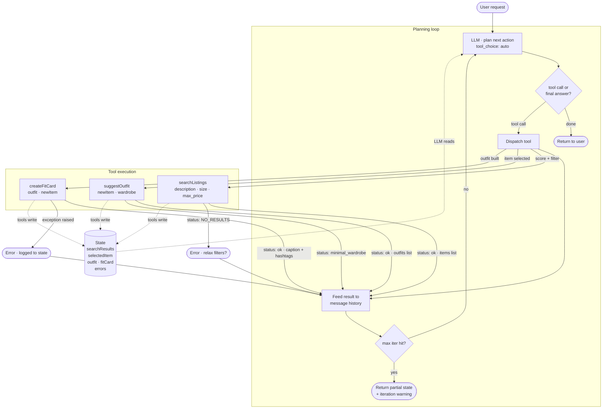

# FitFindr — planning.md

> Complete this document before writing any implementation code.
> Your spec and agent diagram are what you'll use to direct AI tools (Claude, Copilot, etc.) to generate your implementation — the more specific they are, the more useful the generated code will be.
> Your planning.md will be reviewed as part of your submission.
> Update it before starting any stretch features.

---

## Tools

List every tool your agent will use. For each tool, fill in all four fields.
You must have at least 3 tools. The three required tools are listed — add any additional tools below them.

### Tool 1: searchListings

**What it does:**
<!-- Describe what this tool does in 1–2 sentences -->
`searchListings` takes a natural language description of a clothing item, a size, and a maximum price, and returns a list of matching listings from the dataset.

**Input parameters:**
<!-- List each parameter, its type, and what it represents -->
- `description` (str): A natural language description of the type of clothing item the user is looking for
- `size` (str): The size string for the clothing, dependent on the clothing type
- `maxPrice` (float): The maximum price an article of clothing should be

**What it returns:**
<!-- Describe the return value — what fields does a result contain? -->
A list of matching listings, where empty if non found

**What happens if it fails or returns nothing:**
<!-- What should the agent do if no listings match? -->
Return an empty list and notify the user.

---

### Tool 2: suggestOutfit

**What it does:**
<!-- Describe what this tool does in 1–2 sentences -->
`suggestOutfit` takes the new item and the user's wardrobe, suggesting outfit combinations while handling empty wardrobes.

**Input parameters:**
<!-- List each parameter, its type, and what it represents -->
- `newItem` (dict): The new clothing item the user wants to add to their wardrobe
- `wardrobe` (dict): The user's current wardrobe of clothing items

**What it returns:**
<!-- Describe the return value -->
A list of suggested outfit combinations, or an empty list if no combinations can be made.

**What happens if it fails or returns nothing:**
<!-- What should the agent do if the wardrobe is empty or no outfit can be suggested? -->
Return an empty list and notify the user.

---

### Tool 3: createFitCard

**What it does:**
<!-- Describe what this tool does in 1–2 sentences -->
Creates a short description of the outfit as a caption, meant to be shared on social media.

**Input parameters:**
<!-- List each parameter, its type, and what it represents -->
- `outfit` (list): A list of clothing items that make up the outfit

**What it returns:**
<!-- Describe the return value -->
A string containing the generated caption for the fit card.

**What happens if it fails or returns nothing:**
<!-- What should the agent do if the outfit data is incomplete? -->
Return a default caption and notify the user.

---

## Planning Loop

**How does your agent decide which tool to call next?**
<!-- Describe the logic your planning loop uses. What does it look at? What conditions change its behavior? How does it know when it's done? -->
The loop starts with the user query, which is parsed to extract the clothing item description, size, and price. It first calls `searchListings` with this information. If listings are found, it takes the top result and calls `suggestOutfit` with the new item and the user's wardrobe. Finally, it takes the suggested outfit and calls `createFitCard` to generate a caption. The loop ends after the fit card is created and returned to the user.

---

## State Management

**How does information from one tool get passed to the next?**
<!-- Describe how your agent stores and accesses state within a session. What data is tracked? How is it passed between tool calls? -->
The agent stores the results from each tool call in a session state object. This allows it to access the data from previous steps when calling subsequent tools. For example, the result from `searchListings` is passed to `suggestOutfit`, and the output from `suggestOutfit` is passed to `createFitCard`. The session state is updated after each tool call, ensuring that the agent has access to the latest information as it progresses through the planning loop.
The stored data is:
- `userQuery`: The original query from the user
- `searchResults`: The list of listings returned from `searchListings`
- `suggestedOutfits`: The list of outfits returned from `suggestOutfit`
- `fitCardCaption`: The caption returned from `createFitCard`
- `wardrobe`: The user's current wardrobe, which may be updated with new items over time
- `iteration`: The current iteration of the planning loop, which can be used to track progress and prevent infinite loops
- `errors`: Any errors encountered during tool calls, which can be logged and used for debugging or improving

---

## Error Handling

For each tool, describe the specific failure mode you're handling and what the agent does in response.

| Tool | Failure mode | Agent response |
|------|-------------|----------------|
| searchListings | No results match the query | LLM asks user for clarification or broader search terms |
| suggestOutfit | Wardrobe is empty | LLM proceeds to create a fit card with what it has |
| createFitCard | Outfit input is missing or incomplete | LLM reports as error and asks user to try something different |

---

## Architecture

<!-- Draw a diagram of your agent showing how the components connect:
     User input → Planning Loop → Tools (searchListings, suggestOutfit, createFitCard)
                                                                          ↕
                                                                   State / Session
     Show what triggers each tool, how state flows between them, and where error paths branch off.
     ASCII art, a Mermaid diagram (https://mermaid.js.org/syntax/flowchart.html), or an embedded
     sketch are all fine. You'll share this diagram with an AI tool when asking it to implement
     the planning loop and each individual tool. -->

---

## AI Tool Plan

<!-- For each part of the implementation below, describe:
     - Which AI tool you plan to use (Claude, Copilot, ChatGPT, etc.)
     - What you'll give it as input (which sections of this planning.md, your agent diagram)
     - What you expect it to produce
     - How you'll verify the output matches your spec before moving on

     "I'll use AI to help me code" is not a plan.
     "I'll give Claude my Tool 1 spec (inputs, return value, failure mode) and ask it to implement
     searchListings() using load_listings() from the data loader — then test it against 3 queries
     before trusting it" is a plan. -->

**Milestone 3 — Individual tool implementations:**

I will be using Claude to implement the required tools (`searchListings`, `suggestOutfit`, and `createFitCard`),
  using `planning.md` as the driving force. I expect it to produce code that performs as expected based on
  the specifications and alignments.
In addition, I will ask it to provide a template for the tests, which I will then fill them out as I wish.
This is how I will verify the output matches my spec before continuing.

**Milestone 4 — Planning loop and state management:**

I will be using Claude to setup the loop and how to manage state. Additionally, I will ask it to 
  indicate how to efficiently extract the needed information using regex.
What is expected is a loop that correctly calls the tools in the right order, and manages state across calls.
Verification will be done by running interactions and checking the tool calls.

---

## A Complete Interaction (Step by Step)

Write out what a full user interaction looks like from start to finish — tool call by tool call. Use a specific example query.

**Example user query:** "I'm looking for a vintage graphic tee under $30. I mostly wear baggy jeans and chunky sneakers. What's out there and how would I style it?"

**Step 1:**
<!-- What does the agent do first? Which tool is called? With what input? -->
The agent parses the user query to extract the clothing item description ("vintage graphic tee"), size (not specified, so it may default to a common size or ask the user), and maximum price ($30). It then calls `searchListings` with these parameters.
- Input to `searchListings`:
  - `description`: "vintage graphic tee"
  - `size`: (default or user-provided size)
  - `maxPrice`: 30.0

**Step 2:**
<!-- What happens next? What was returned from step 1? What tool is called now? -->
Assuming `searchListings` returns a list of matching listings, the agent takes the top result (the most relevant vintage graphic tee) and calls `suggestOutfit` with this new item and the user's wardrobe (which includes baggy jeans and chunky sneakers).
- Input to `suggestOutfit`:
  - `newItem`: (the top listing from searchResults)
  - `wardrobe`: (the user's current wardrobe, including baggy jeans and chunky sneakers)

**Step 3:**
<!-- Continue until the full interaction is complete -->
Assuming `suggestOutfit` returns a list of suggested outfit combinations, the agent takes the top outfit suggestion and calls `createFitCard` to generate a caption for the fit card.
- Input to `createFitCard`:
  - `outfit`: (the top outfit suggestion from suggestedOutfits)
- Output from `createFitCard`:
  - A caption describing the outfit, such as "Rocking a vintage graphic tee with my favorite baggy jeans and chunky sneakers for a casual, retro vibe!"

**Final output to user:**
<!-- What does the user actually see at the end? -->
The user sees the generated caption for the fit card, along with the suggested outfit details (the vintage graphic tee, baggy jeans, and chunky sneakers) that they can consider for their new look.